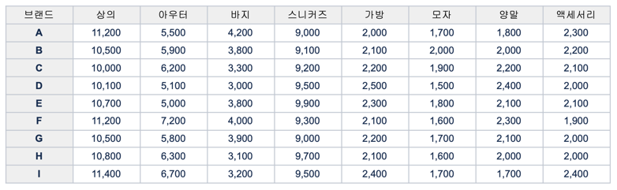

# MUSINSA 백엔드 개발 직무 과제

## 요구사항
무신사는 8개의 카테고리에서 상품을 하나씩 구매하여, 코디를 완성하는 서비스를 준비중입니다.

[사전 준비 데이터]


준비된 데이터를 기반으로
1. 고객은 카테고리 별로 최저가격인 브랜드와 가격을 조회하고 총액이 얼마인지 확인할 수 있어야 합니다.
2. 고객은 단일 브랜드로 전체 카테고리 상품을 구매할 경우 최저가격인 브랜드와 총액이 얼마인지 확인할 수 있어야 합니다.
3. 고객은 특정 카테고리에서 최저가격 브랜드와 최고가격 브랜드를 확인하고 각 브랜드 상품의 가격을 확인할 수 있어야 합니다.
4. 운영자는 새로운 브랜드를 등록하고, 모든 브랜드의 상품을 추가, 변경, 삭제할 수 있어야 합니다.

[고려 예외 사항]
- 구매 가격 외의 추가적인 비용(예, 배송비 등)은 고려하지 않음.
- 브랜드의 카테고리에는 1개의 상품은 존재하고, 구매를 고려하는 모든 쇼핑몰에 상품 품절은 없다고 가정

## 구현 범위
### 1. Entity 구조
- Product (상품)
  - 상품명, 가격, 상태(ACTIVE, INACTIVE, SOLD_OUT) 관리
  - 브랜드, 카테고리와 연관 관계
- Brand (브랜드)
  - 브랜드명 관리
  - 상태(ACTIVE, INACTIVE) 관리
  - 브랜드 삭제 시 연관된 상품의 브랜드 참조 제거
- Category (카테고리)
  - 카테고리명 관리
  - 상태(ACTIVE, INACTIVE) 관리
  - 카테고리 삭제 시 연관된 상품의 카테고리 참조 제거

### 2. 기능 구현
1. 카테고리별 최저가격 브랜드와 상품 가격, 총액을 조회하는 API
2. 단일 브랜드로 모든 카테고리 상품을 구매할 때 최저가격 브랜드와 총액을 조회하는 API
3. 카테고리 이름으로 최저, 최고 가격 브랜드와 상품 가격을 조회하는 API
   * JPA N+1 문제 해결을 위하여 FETCH JOIN 쿼리 메서드 사용  
4. 브랜드 및 카테고리 추가/업데이트/삭제 API
   * Soft Delete 패턴 적용
   * 중복 브랜드명, 카테고리 등록/수정 시 사용 불가 처리
   * 성능 최적화(인덱스) 
5. 상품 추가/업데이트/삭제 API
   * Soft Delete 패턴 적용
   * 중복 브랜드명 등록/수정 시 사용 불가 처리
   * 성능 최적화(인덱스)
5. 프론트엔드 구현
   * Thymeleaf + Jquery 를 사용하여 고객용 화면 구현
   * 백오피스 브랜드 관리, 상품 관리 화면은 미구현
6. 테스트 코드 작성
   * Unit Test, Integration Test 작성

### 3. 기술적 특징
- Soft Delete 패턴 적용
- 도메인 주도 설계(DDD) 적용
- 글로벌 예외 처리
- JPA N+1 문제 해결(FETCH JOIN)
- 테스트 코드 작성
- 성능 최적화 (인덱스)

## 빌드 및 실행 방법

### 요구사항
- Java 17
- Gradle 8.x

### 빌드 방법
```
./gradlew clean build
```
### 테스트 실행 방법
```
./gradlew test
```

### 실행 방법
```
./gradlew bootRun
```

### 테스트 DB 확인
- H2 Console: http://localhost:8080/h2-console
- JDBC URL: jdbc:h2:mem:testdb
- Username: sa
- Password: (empty)

## 추가 정보

### 패션 코디 프론트
- URL: http://localhost:8080/coordination

### 패션 코디 API
- GET /api/coordination/categories/lowest-prices - 카테고리별 최저가 상품 조회
- GET /api/coordination/brands/lowest-prices - 단일 브랜드 코디 최저가 조회
- GET /api/coordination/categories/{categoryName}/price-info - 카테고리별 최저가/최고가 조회

### 상품 API
- POST /api/products - 상품 등록
- GET /api/products/{id} - 상품 조회
- PUT /api/products/{id} - 상품 수정
- DELETE /api/products/{id} - 상품 삭제

### 브랜드 API
- POST /api/brands - 브랜드 등록
- GET /api/brands/{id} - 브랜드 조회
- PUT /api/brands/{id} - 브랜드 수정
- DELETE /api/brands/{id} - 브랜드 삭제

### 카테고리 API
- POST /api/categories - 카테고리 등록
- GET /api/categories/{id} - 카테고리 조회
- PUT /api/categories/{id} - 카테고리 수정
- DELETE /api/categories/{id} - 카테고리 삭제
